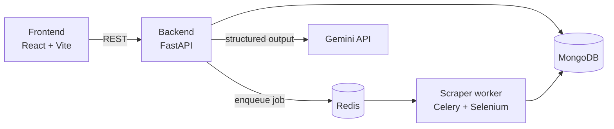

# Reviews Analysis Platform

A web platform that collects customer reviews for a business and analyzes them with an LLM. Reviews come from Google Maps (scraped) or a CSV upload; the analysis returns sentiment, topics, spam flags, urgency and business insights.

## What it does

- **Organizes reviews** by business, location and source.
- **Scrapes Google Maps reviews** in a background worker, with job status and progress tracking.
- **Imports reviews from CSV** as an alternative source.
- **Analyzes reviews with Gemini**, returning structured output for the tasks you select: language detection, translation, sentiment, topics, spam detection, urgency and business insights.
- **Processes in batches** with retry: a failed batch of 100 is retried at 50, then 20.
- **Tracks usage and cost** per user against subscription plan limits.
- **Handles accounts**: registration, email verification, JWT login and reCAPTCHA.

## Architecture



The backend never scrapes. It creates a job, sends it to the `scraping` queue through Celery, and the worker writes reviews and progress back to MongoDB.

## Tech stack

| Part | Tools |
|---|---|
| Backend | Python, FastAPI, Pydantic, Motor (async MongoDB), Celery |
| Scraper | Selenium, undetected-chromedriver, Celery worker |
| Analysis | Google Gemini (`google-genai`) with dynamic Pydantic schemas |
| Frontend | React 18, TypeScript, Vite, Tailwind CSS |
| Data | MongoDB, Redis |
| Tooling | Docker Compose, pytest, pre-commit (black, isort, ruff), Bruno API collections |
| Deployment | GitHub Actions, Trivy scan, Google Cloud Run |

## Run locally

Requires Docker and a Gemini API key.

1. Create a `.env` file at the repository root:

   ```env
   GIMINI_API_KEY=your-gemini-api-key
   GIMINI_MODEL_NAME=your-gemini-model
   RESEND_API_KEY=your-resend-api-key
   RECAPTCHA_URL=your-recaptcha-verify-url
   ```

2. Start the stack:

   ```bash
   docker compose up --build
   ```

3. Open the services:

   | Service | URL |
   |---|---|
   | Frontend | http://localhost:3000 |
   | Backend API docs | http://localhost:8000/docs |
   | Scraper health check | http://localhost:8080/health |

## Project layout

```
backend/    FastAPI app: routers, repositories, models, analysis services
scraper/    Celery worker and Google Maps scraper
frontend/   React app
tests/      pytest tests for the API and scraper config
bruno/      Bruno API request collections
.github/    CI and deployment workflow
```

## Tests

```bash
pip install -r backend/requirements.txt -r requirements-dev.txt
cd backend && PYTHONPATH=app pytest ../tests -v
```

## Deployment

`.github/workflows/deploy.yml` runs tests and a Trivy scan, builds the three images, and deploys the backend, frontend and scraper to Google Cloud Run. It needs these repository secrets: `GCP_PROJECT_ID`, `GCP_PROJECT_NUMBER`, `GCP_SA_KEY`, `MONGODB_URI`, `MONGODB_DB_NAME`, `REDIS_URL`, `GIMINI_API_KEY`, `GIMINI_MODEL_NAME`, `RESEND_API_KEY` and `RECAPTCHA_URL`.

`docker-compose.prod.yml` is a production-style Compose setup for running the same stack on a single host.

## Status

The platform ran in production at reviewoly.com in 2025. The hosted version is no longer online; the code here is the last deployed state.
